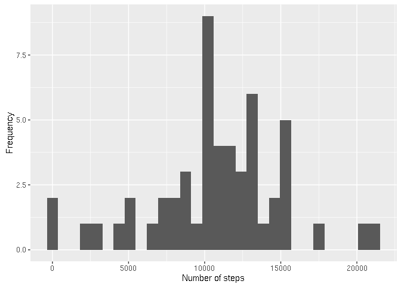
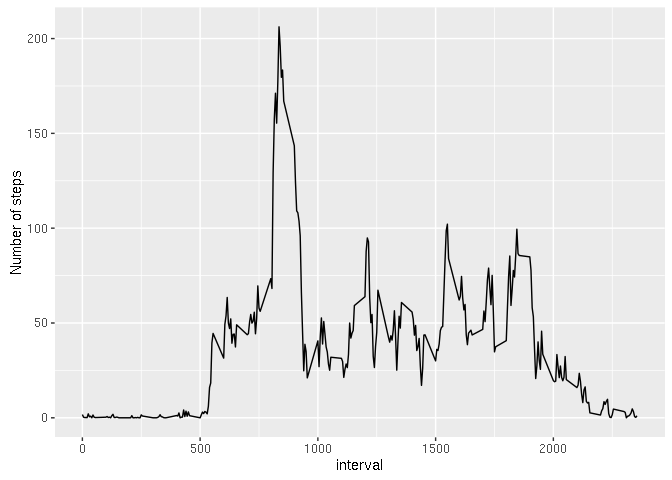

# Reproducible Research: Peer Assessment 1

## Loading and preprocessing the data

```r
tmp <- tempfile()
download.file("http://d396qusza40orc.cloudfront.net/repdata%2Fdata%2Factivity.zip",tmp)
unzip(tmp)
unlink(tmp)
data<-read.csv("activity.csv")
```

## What is mean total number of steps taken per day?
Here is the histogram of the total number  of steps taken each day

```r
sbd<-aggregate(steps~date,data,sum)
qplot(sbd$steps, geom="histogram", xlab="Number of steps", ylab="Frequency")
```

```
## `stat_bin()` using `bins = 30`. Pick better value with `binwidth`.
```

<!-- -->

Where the mean is 1.0766189\times 10^{4} and median is 10765.

## What is the average daily activity pattern?

```r
sbi <- aggregate(steps ~ interval, data, mean)
qplot(sbi$interval,sbi$steps,geom = "line",xlab ="interval", ylab="Number of steps")
```

<!-- -->

The 5-min interval which contains the maximum number of steps on average is 835.

## Imputing missing values

```r
non_nas<-sum(!complete.cases(data))
imputed<-transform(data, steps = ifelse(is.na(data$steps), sbi$steps[match(data$interval, sbi$interval)], data$steps))
```


## Are there differences in activity patterns between weekdays and weekends?
