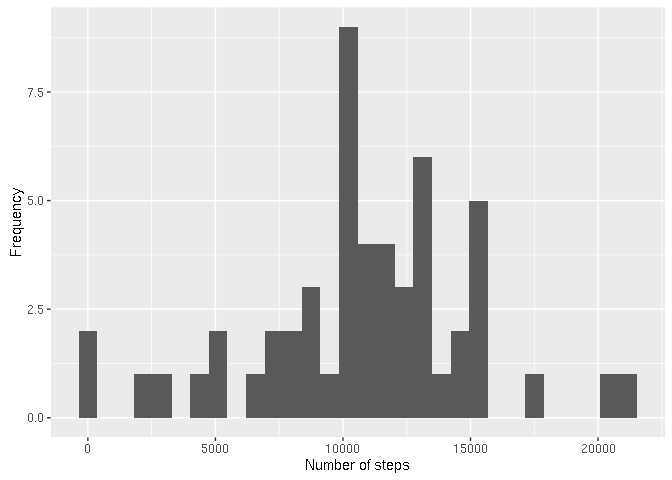
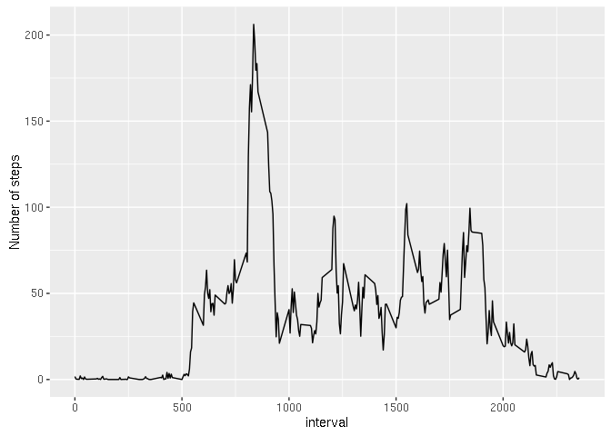
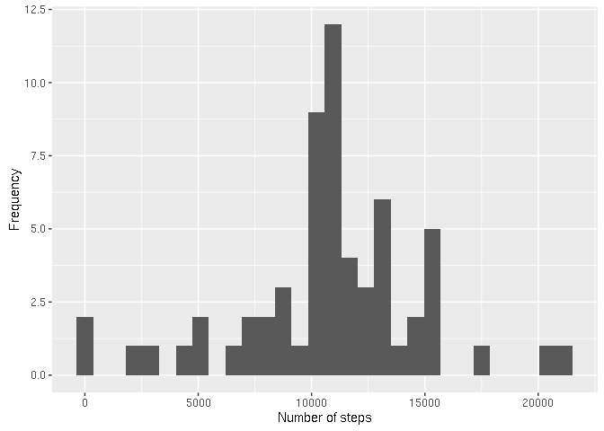
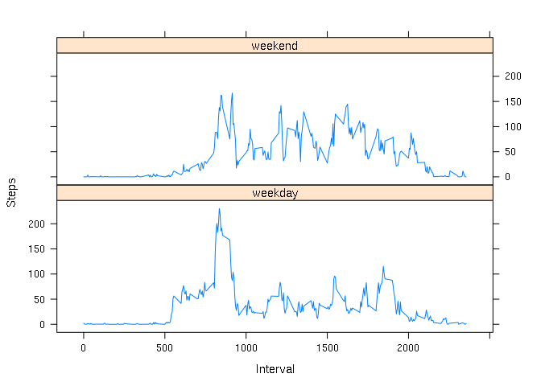

# Reproducible Research: Peer Assessment 1

## Loading and preprocessing the data

```r
tmp <- tempfile()
download.file("http://d396qusza40orc.cloudfront.net/repdata%2Fdata%2Factivity.zip",tmp)
unzip(tmp)
unlink(tmp)
data<-read.csv("activity.csv")
```

## What is mean total number of steps taken per day?
Here is the histogram of the total number  of steps taken each day

```r
sbd<-aggregate(steps~date,data,sum)
qplot(sbd$steps, geom="histogram", xlab="Number of steps", ylab="Frequency")
```

```
## `stat_bin()` using `bins = 30`. Pick better value with `binwidth`.
```

<!-- -->

Where the mean is 1.0766189\times 10^{4} and median is 10765.

## What is the average daily activity pattern?

```r
sbi <- aggregate(steps ~ interval, data, mean)
qplot(sbi$interval,sbi$steps,geom = "line",xlab ="interval", ylab="Number of steps")
```

<!-- -->

The 5-min interval which contains the maximum number of steps on average is 835.

## Imputing missing values

```r
num_nas<-sum(is.na(data))
imputed<-transform(data, steps = ifelse(is.na(data$steps), sbi$steps[match(data$interval, sbi$interval)], data$steps))
```
The number of  missing values in the data set is 2304. This dataset was imputed by changing the NAs with the average for each time interval.


```r
sbdi<-aggregate(steps~date,imputed,sum)
qplot(sbdi$steps, geom="histogram", xlab="Number of steps", ylab="Frequency")
```

```
## `stat_bin()` using `bins = 30`. Pick better value with `binwidth`.
```

<!-- -->

```r
imean<-mean(sbdi$steps)
imedian<-median(sbdi$steps)
diff_mean<-abs(smean-imean)
diff_median<-abs(smedian-imedian)
```
The mean of the imputed data is 1.0766189\times 10^{4} and the median 1.0766189\times 10^{4}.

The difference of the mean between the original date and the imputed data is 0 and the median 1.1886792.


## Are there differences in activity patterns between weekdays and weekends?


```r
weekdays <- c("Monday", "Tuesday", "Wednesday", "Thursday", "Friday")
imputed$weekdays = as.factor(ifelse(is.element(weekdays(as.Date(imputed$date)),weekdays),"weekday", "weekend"))
sbii<- aggregate(steps ~ interval + weekdays, imputed, mean)
xyplot(sbii$steps ~ sbii$interval|sbii$weekdays,xlab="Interval", ylab="Steps",layout=c(1,2), type="l")
```

<!-- -->
